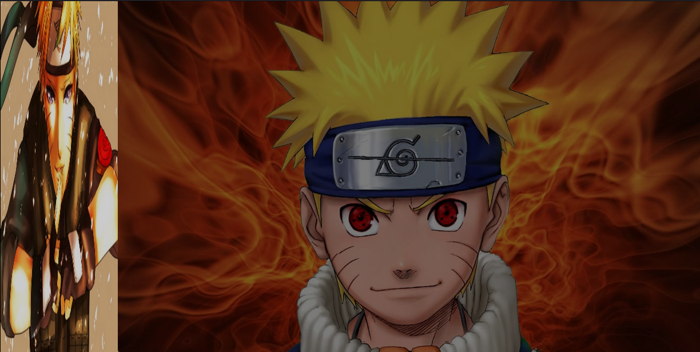
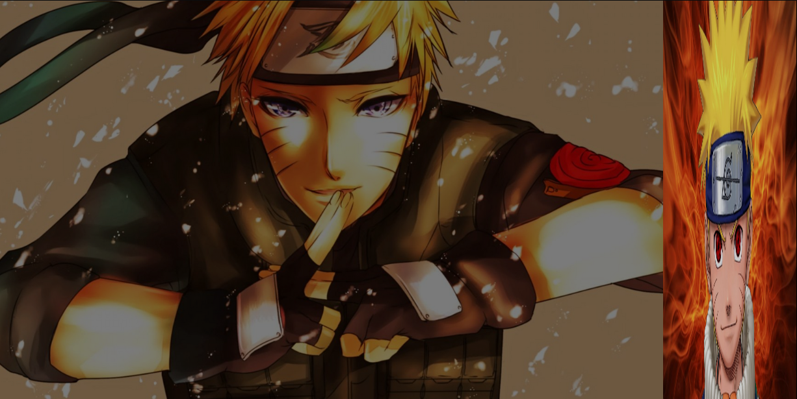

# EFEITO CSS

Neste exemplo de efeito CSS, duas imagens são posicionadas lado a lado. Ao passar o mouse sobre uma das imagens, ambas sofrem alterações na opacidade. A imagem que recebe o hover se expande na tela, enquanto a imagem adjacente diminui de tamanho. Isso destaca a imagem em foco, proporcionando um efeito visual atraente e claro.

## Screen

<h1 align="center">💻 Desenvolvido Por: Gilberto Júnior</h1>